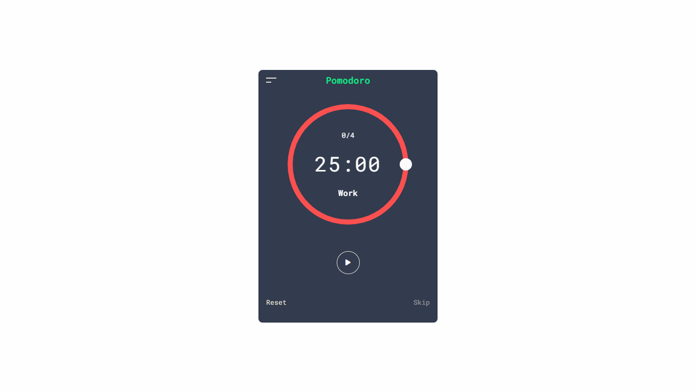
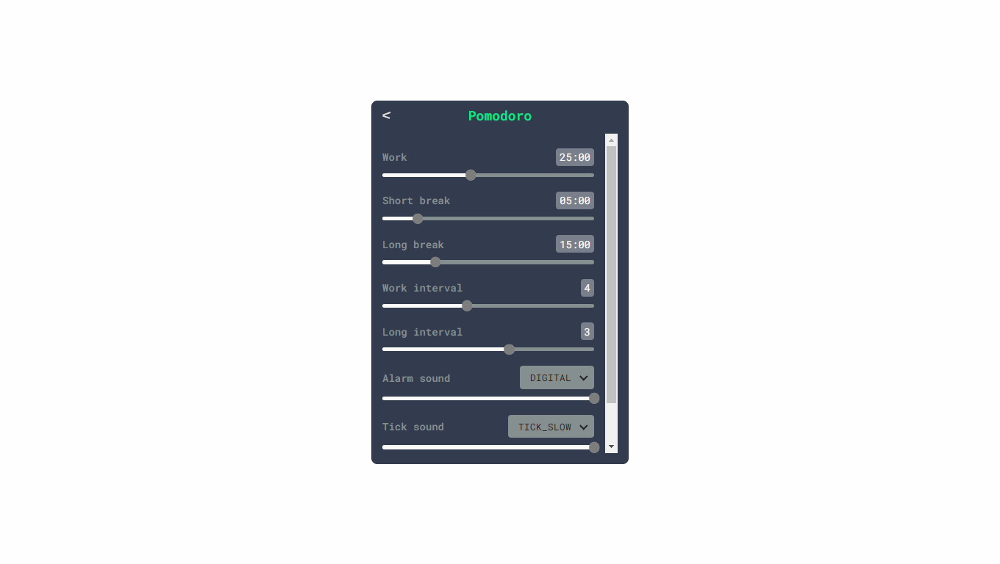
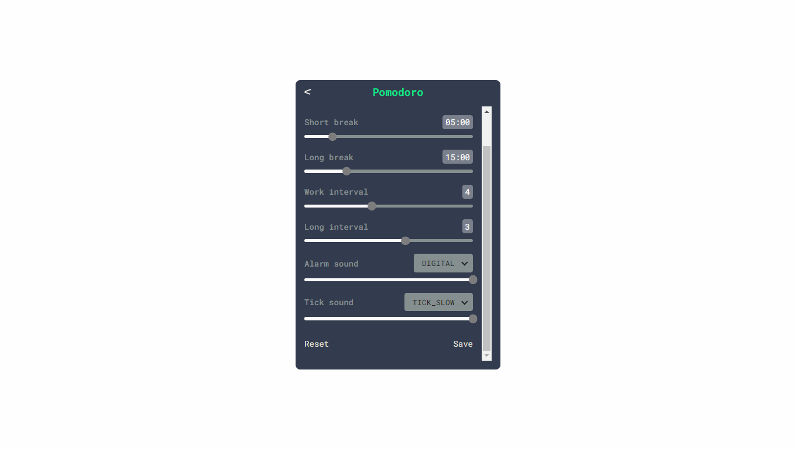
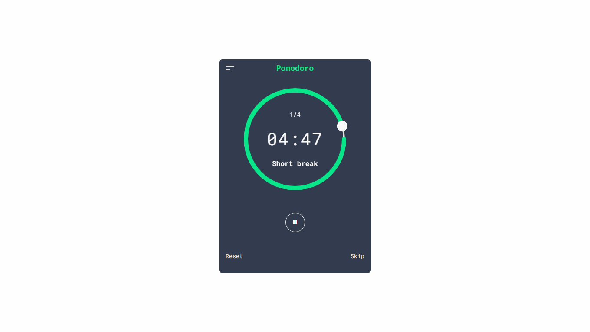
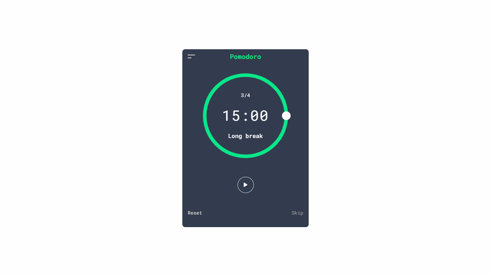

# React Pomodoro Timer App

This project is a Pomodoro timer application built with React and Redux Toolkit. It allows users to set customizable time intervals for work and breaks, and includes audio notifications when the time is up.

# Design

[LINK](https://dribbble.com/shots/4172422-Pomotroid-Screens/attachments/10241013?mode=media)

# Technologies Used

- React
- Redux Toolkit
- Sass

# Features

- Audio notification at the end of a timer period
- Customizable timer intervals to suit your preference

# Screenshots

    

# Installation and Usage

- Clone the repository.
- Navigate to the project directory.
- Run npm install to install dependencies.
- Run npm run dev to start the development server.
- Open http://localhost:3000 in your web browser.

# License

This project is licensed under the MIT License. See the [LICENSE](./LICENSE.md) file for details.
